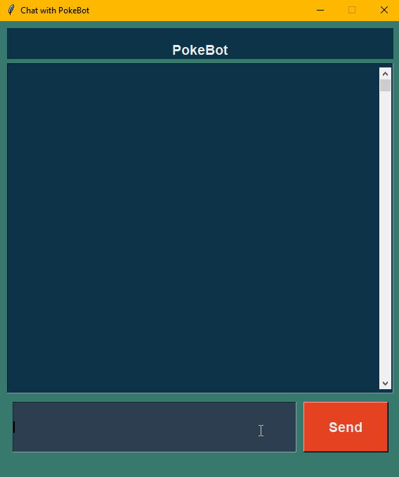

# NLP POKEMON CHATBOT :zap:
---
#### This is a chatbot that can talk to you about pokemon. It was created for an assignment for my NLP course.
#### It uses NLTK, and the pokemon data from pokeapi.co via the pypokedex library and some regEx.
##### Pokemon names are checked using the pokemon.csv file.

##### The chatbot is rule based and can be used in the following ways:
- [x] Greet the chatbot: Saying, Hi, Hello will trigger an appropriate response.
- [x] Ask the chatbot about a pokemon: Saying, what is a pikachu, or what is a bulbasaur, or what is a charmander, or what is a squirtle, etc will trigger an appropriate response.
- [x] Ask the chatbot about a pokemon via name or id# will trigger an appropriate response.
- [x] Say goodbye to the chatbot: Saying, Goodbye, or Bye will trigger an appropriate response.
- [x] Saying thanks to the chatbot will trigger an appropriate response.

---

No AI is used in this project.